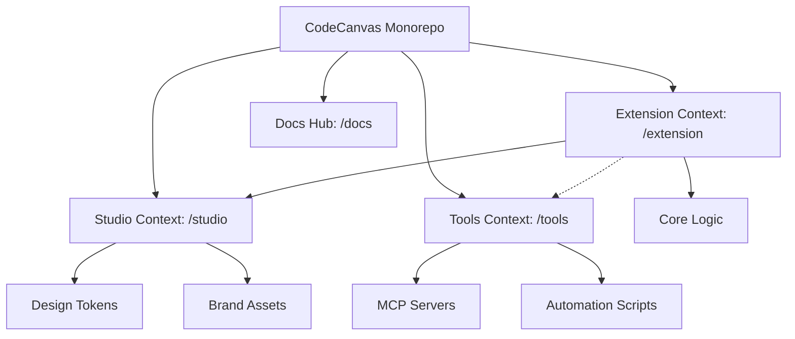

# Bounded Context

We use **PNPM Workspaces** with a **Context-Driven Root** layout to strictly isolate our business domains. This architecture ensures scalability and clear separation of concerns by organizing the codebase into distinct Bounded Contexts at the root.

## Monorepo Structure & Application Roles

The monorepo distinguishes between different core contexts, notably **Studio** and **Extension**. The following diagram illustrates the workspace contexts, package relationships, and dependency flow:

| Directory              | Package Name        | Role          | Responsibility                                                 |
| :--------------------- | :------------------ | :------------ | :------------------------------------------------------------- |
| extension/             | @codecanvas/extension | **Product**   | Core Visual Studio Code Extension logic.                       |
| studio/                | @codecanvas-studio/assets  | **Tooling**   | Brand tokens, design assets, and global styling.               |
| tools/                 | @code-canvas/tools | **Tooling**   | MCP infrastructure, automation scripts, and project utilities. |
| docs/                  | @codecanvas/docs  | **Docs Hub**  | Official project documentation hub and technical landing page. |

## Bounded Context Philosophy

- **Context Isolation**: Each root directory (`extension/`, `studio/`, etc.) represents a Bounded Context. Logic and models are duplicated when necessary to maintain independence.
- **Deployment**:
  - **Extension**: Designed to be compiled and bundled for VS Code.
  - **Docs Hub**: The **authoritative project hub** for documentation (CodeCanvas Docs).

### Extension Context (extension/)

The core product of CodeCanvas. For detailed documentation, see the **[Extension Workspace](/workspaces/extension/intro)**.

- **`@codecanvas/extension`**: VS Code Extension logic and commands.

### Studio Context (studio/)

The single source of truth for the project's visual identity and shared UI tokens. For detailed documentation, see the **[Studio Workspace](/workspaces/studio)**.

- **Design Tokens**: Centralized CSS variables and TypeScript constants.
- **Brand Assets**: Canonical logos, icons, and 3D models.
- **AI Orchestration**: System bridge for agentic workflows.

### Tools Context (tools/)

The automation backbone and infrastructure orchestration hub. For detailed documentation, see the **[Tools Workspace](/workspaces/tools)**.

- **MCP Servers**: Model Context Protocol servers (GitHub, Context7, Docker Hub) providing structured context to AI agents.
- **Infrastructure**: Docker configurations and runtime environments for development tools.
- **Automation**: Technical scripts for maintenance, key generation, and workspace health.

### Docs Context (docs/)

The developer documentation hub (CodeCanvas Docs). For detailed documentation, see the **[Docs Workspace](/workspaces/docs)**.

- **Docusaurus studio**: Multi-extension documentation sidebar layout.
- **Localization**: Parity between English (`en`) and Portuguese (`pt-BR`) locales.
- **Root Compilation**: Script pipelines generating root-level documentation files.
