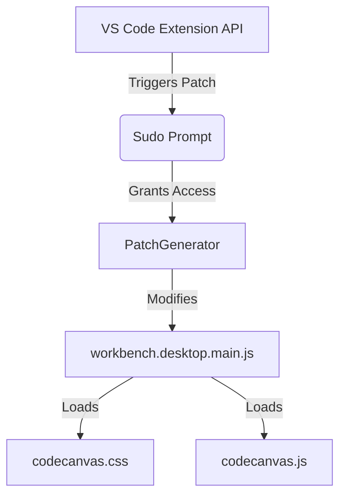

# Extension Workspace

A workspace `extension` (`@codecanvas/extension`) contém o produto central do **CodeCanvas**: uma extensão de alta performance para o Visual Studio Code projetada para transformar completamente o ambiente de desenvolvimento através de customizações avançadas de interface, injetando CSS e manipulando o DOM do editor.

## Arquitetura e Patching System

O VS Code, por padrão, não permite customizações arbitrárias na sua interface (DOM/CSS) por motivos de segurança e estabilidade. O **CodeCanvas** contorna essa limitação utilizando um sistema robusto de *patching*:

1. **Localização do Core**: A extensão descobre o caminho de instalação local do VS Code e localiza o arquivo principal de UI (`workbench.desktop.main.js` ou similar).
2. **Injeção (Patch)**: O sistema injeta um script (`codecanvas.js`) e um arquivo de estilo (`codecanvas.css`) no HTML interno do editor de forma persistente.
3. **Gerenciamento de Estado**: Como os arquivos originais do VS Code são modificados, a extensão precisa solicitar privilégios administrativos (via `@vscode/sudo-prompt`) quando a injeção for realizada no Windows ou Linux (diretórios protegidos).

{/* TODO: Consider adding an architectural diagram here using mermaid */}

## Integração Automática de Temas

A inovação central do `extension` é sua comunicação direta com a configuração de temas:

- **Configuração em Runtime**: A extensão expõe propriedades como `codecanvas.enabled` e `codecanvas.ui`.
- **Observer de Temas**: Quando o usuário troca de tema no VS Code, a extensão analisa o JSON do tema ativo.
- **Background Config**: Se o tema contiver uma propriedade especial `backgroundConfig`, o CodeCanvas lê e aplica automaticamente essas configurações ao CSS injetado, permitindo que os temas (construídos pela workspace `studio/themes`) ditem as imagens de fundo, opacidades e cores.

## Bounded Context

Este pacote é isolado. Ele consome configurações do `@codecanvas-shared/config` durante o build e carrega os temas do `@codecanvas-studio/themes`, empacotando tudo com `esbuild` de forma otimizada para o runtime do VS Code.
