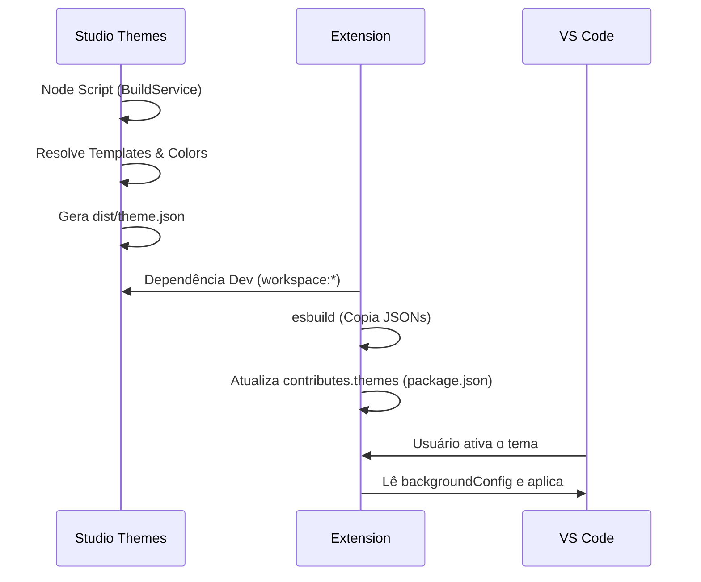

# Studio Themes

A workspace `studio/themes` (`@codecanvas-studio/themes`) atua como o laboratório criativo responsável por definir, compilar e exportar os temas oficiais do CodeCanvas. Ela funciona em total sinergia com a extensão do VS Code.

## Arquitetura de Cores e Templates

A construção de temas no VS Code exige a definição de centenas de tokens de sintaxe e variáveis de ambiente (como cores de background, bordas, status bar, etc.). Fazer isso manualmente para cada novo tema é inviável e repetitivo.

O sistema de temas do CodeCanvas resolve esse problema abstraindo a criação em um sistema de *Templates*:

1. **ColorExtractor**: Extrai variáveis CSS de `src/defaults/` baseadas em padrões estéticos consistentes.
2. **Templates de Base**: Os arquivos `dark-template.json` e `light-template.json` (em `src/templates/`) contém a fundação do tema, mapeando as variáveis.
3. **DevThemes**: Cada novo tema (ex: `anime.bleach.yoruichi.dark-purple-theme.json`) define apenas as *diferenças*, as cores de sotaque específicas e, criticamente, o objeto `backgroundConfig` que informa à extensão quais imagens e opacidades usar.
4. **ThemeResolver**: Mescla o DevTheme com o Template base e gera um arquivo de tema JSON pronto para o VS Code.

## Integração em Tempo de Build

Os temas não são gerados e colados manualmente na extensão. O processo é totalmente automatizado através da pipeline de build:

Sempre que um novo tema é adicionado em `studio/themes/src/defaults/`, basta executar o build da extensão e o tema será automaticamente compilado, injetado no diretório `dist/themes/` da extensão, e registrado no `package.json` para ficar disponível imediatamente aos usuários finais.
